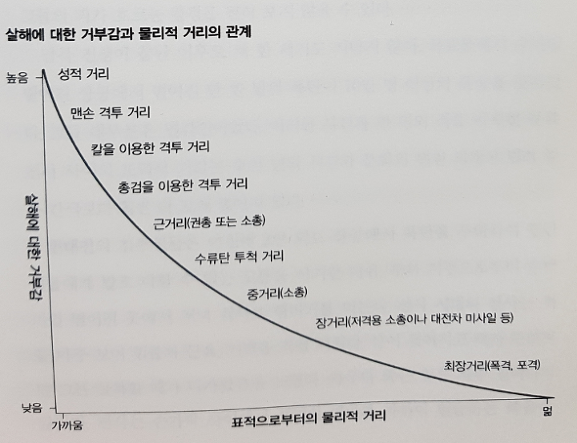
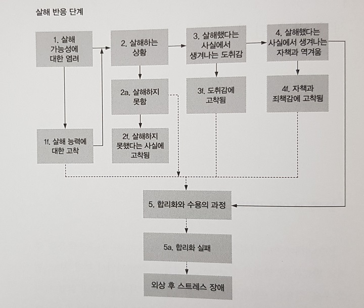
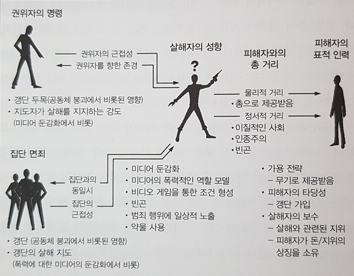

`ㅎㅇㅎㅇ

# 살인의 심리학

### 1. 살해에 대한 거부감, 
- 살인행위를 거부하게 하는 강력한 요인이 인간종에게 존재함
- 결정적순간(쏠까?말까?)에 양심적병역거부가 일어남
- 적을 살해하지 않았던 많은 군인들과 그에대한 증거가 많음
  - 수치스러운 행동이라고 생각했던 군인들
  - 열심히 싸웠던사람도 그 심정에 대해 이해하고 침묵함
  - 역사 속에서 침묵의 공모가 일어났음
  - 많이 안 알려졌지만 이제부터 알아보자

### 2. 군인들은 왜 멘탈이 나갈까
 전쟁에서 일어나는 일에 대해 제대로 이해해야 한다

- 전투에 노출된(길든 짧든 결국에는) 군인들의 98%는 **정신적 사상자**가 됨
- 2%는 이미 미쳐있던 것으로 보임, 싸이코패스? 얘네는 놀랄만큼 오래 잘 싸움
- 왜 멘탈이 나갈까??

  

##### 1. 두려움
  - 많은 사람들이 생각하는 직접적인 원인, 그러나..
  - 폭격받은 민간인들 - 멘탈나가랏- 왜 민간인들이 군인보다 정신이 멀쩡하지?
  - 소총으로 적을 쏠일 없는사람들 - 의무병, 장교, 해병, 공군,기관총 - 상대적으로 멘탈 ㄱㅊ
  - 두려움이 유일한원인은아닌거같은데?

##### 2. 피로
  - 피로요인들이 많다(전투스트레스(각성-이완), 수면결핍, 식량부족, 날씨...)
  - 개빡센훈련의 이유->높은스트레스경험, 심리적트라우마에 내성을키움  ~~신진환회원님 빠이팅!~~

##### 3. 감정적 동요 

  - 같은 상황에서 종군기자, 포로, 비전투원(위생병 등..) 보다 전투원들이 훨씬 심하게 공포를 느낌

- 책임감, 의무를 크게 느낌 - 모든 죽은 적군은 내탓, 모든 아군을 지켜야 한다고 느낌
  
  
  
##### 4. 증오를 마주침

  - 우린 사실 신체적 고통, 상해에 대한 두려움을 즐기기도함

  - 다른 사람의 적대감에 대해 가장 큰 공포를 느낀다 (모욕, 따돌림, 구타, 강간..)

    - 전투트라우마는 강간트라우마랑 비슷하다? (죽거나 다칠거라는 두려움과 관계가없다)

    - 적대감을 마주치는것은 엄청난 스트레스(주요한 자살 요인..) 

    - 공습(집단에게 무작위로 가해짐)을 받았던 민간인들은 정신이 멀쩡했지만 (오히려 생산량 증가)

    - 나치강제수용소(개인에게 가해지는 괴롭힘)에서는 거의 전부가 정신적 트라우마를 겪음

    - 공습 보다는 침공이 일어났을 때 사람들은 패닉에 빠진다

- 훈련을 통한 예방접종?

  - 학습된무기력..(탈출수단이 있어도 빠져나오지 않는 개)

  - 무기력을 학습하기 전에 탈출을 해보면 다음부터는 무기력해지지않는다

  - 군사훈련소에서는...

    - 소리를 지르는 교관, 격투 훈련 같은 것들을 견디다가
    - 명예롭게 수료, 자부심을 가짐

    - 노골적인 적의를 극복할 수 있게됨 -> 증오에 대한 예방접종ㅠㅠ

##### 6. 의지력
  - '타고난 용기' - 2%의 오랜시간 잘싸우는 사람들
  - 98%에게 ''용기''는 소모품, 결국엔 멘탈나감, 의지의 고갈==>"정신적 사상자"
  - **의지력을 나눠받기도함 ->용감한 지휘관** or 승리

##### 7. 살해하는 스트레스
- 같은 종을 죽이지 않으려하는 거부감
- 미디어의 오해, 살해는 고통스럽다
- 살해하지 않은 죄책감 - 동료가 죽어가는 상황에서 총을 쏘지않은 트라우마
- 지휘관의 죄책감 - 다른조치를 취했더라면 병사가 안죽었을 텐데.. -> 훈장을 주는 이유

##### #장님 코끼리 만지기 - 정신적 사상자에 대해 사람들은 이해하지못함

- 미디어의 영향 
  - 람보, 인디애나 존스, 제임스 본드.. 등등
  - 전투, 살해가 쉽게 여겨짐
- 전쟁에서 무슨 일이 일어나는지 그대로 다루는 것은 고통스러움, 거부감
- 관계자들마저도 아래에서 나오는 내용에 대해 전부 알지 못함 ex) 참전용사의 어려움 --> 적응의 문제라고 생각함

**"전쟁에서 일어나는 일에 대해 제대로 이해해야 한다"**

### 3. 살해와 물리적 거리
- 거리가 멀어짐에 따라 공격이 더 쉬워진다
- 피해자에 공감하는 능력은 물리적 거리에 반비례함

{:.alignleft}

- 성적 거리?
  - 피해자와 거리가 극단적으로 가까울 때 살해와 성행위가 뒤섞임
  - 권력과 정복?? 이해안되는데ㅋㅋ 알아서 읽어보고 얘기해보자

**"우리 안에 자리한 어둠과 파괴의 힘은 동료 인간을 향한 빛과 사랑의힘으로 균형잡혀있다. 
이 힘들은 우리 각자의 마음속에서 투쟁하며 서로 겨루고 있다. 
한 쪽을 무시하는 것은 곧 다른 쪽을 무시하는 것과 같다. 
어둠을 인정하지 않는다면, 우리는 빛을 알 수 없다. 
죽음을 인정하지 않는다면, 우리는 삶을 알 수 없다."**

### 4. 살해의 해부:고려대상이 되는 모든요인들

{:.alignleft}

- 권위에 대한 복종

  - [밀그램실험](https://namu.wiki/w/%EB%B0%80%EA%B7%B8%EB%9E%A8%EC%9D%98%20%EB%B3%B5%EC%A2%85%20%EC%8B%A4%ED%97%98) - 권위는 아주강력함, 악의 보편성?
  - 누구의 명령? 보고있나? 구체적인 명령?

- 집단 면죄 
  - 대포, 기관총 - 여럿이서 쏘는 무기, 책임의 분산
  - "살해자는 개인이 아니라 집단이다"
  - "그들이 내 친구들을 죽이고 있다"
  
- 정서적 거리
  
  - 문화: 인종, 민족
  - 도덕: 우리 집단의 도덕적우월성에 대한 믿음
  - 사회: 계층간 거리..
  - 기계: 화면, 조준경, 야간투시경..

- 피해자의 특성
  - 전략의 타당성: 살해시도가 얼마나 성공가능?
  - 피해자의 타당성, 보수
    - 나에게 공격? 적군내 위치? 무장을했는가? (철모<베레모 인이유)
    - 적인데 여성?
- 살해자의 성향
  - 어떤훈련을 받았는가
  - 최근의 경험: ex) 동료의 죽음..
  - '타고난 군인'의 기질
    
    - 2%는 정당한 이유가 주어진다면 후회나 자책없이 살해가 가능
    
    - 장기간 전투를 해도  '정신적 사상자'가 되지않음
    
    - 그렇다고 얘네가 전부 나쁜게 아님 - 전시에만 이런성향 보이는 사람이 있음(늑대, 목양견)

- 적용 -미라이 학살: 베트남 전쟁 중인 1968년 3월 16일 남베트남 미라이에서 발생한 미군에 의해 벌어진 민간인 대량 학살이다. - 검색 시 사진 주의..

  - 어떻게 군인들이 학살을? 

  - 훈련: 죽이는행위 연습, 정신교육?-베트남인들을 비인간화함

  - 민간인속으로 사라지는 적군에게 계속피해를입음

  - 명령을 받음

  - 이런 많은조건들이 충족되면 학살이 일어날 수 있음

**"사회는 전투에서의 살해 과정과 살해에 따른 대가가 얼마나 엄청난 것인지를 이제 이해하려 해야한다. 사회가 이를 이해하고 나면, 살해는 결코 예전과 동일한 것으로 보이지 않게 될것이다."**

### 5. 살해와 잔학 행위

- 잔학행위 : 비전투원을 죽이는것
- 잔학행위의 스펙트럼
  - 명예로운 적 
  
  - 게릴라일수도있는 민간인 
  
  - 방금 전까지 나한테 총을쏘다가 항복한 적
  
  - 처형 
- 잔학행위가 일어나는 이유
  - 테러리즘: 몽고군이 강력했던 이유, 항복or다죽임
  - 살해역량강화: 중국 포로로 살해를 연습하던 일본군, 살인병기가됨?
  - 지휘관, 동료에 대한 유대감, 불만의 해소: 승리 후 약탈/강간/살해가 지도자에 의해 권장되기도함
- 잔학행위에 대한 사람들의 일반적인 반응은 '부정'
- **"그러나 우리는 부인해서는 안된다...잔학행위의 존재를 불신하거나 외면하려는 이 단순하고 순진한 경향이야말로 오늘날 우리세계에 잔학 행위와 공포가 지속되는데 다른 그 어떤 요인들보다 더 큰 책임이 있을것이다"**
- 잔학행위의 함정 

  - 세계로부터 고립됨.. 천안문..?

  - 적군의 역량강화, 포로를 안남기면 더 격렬하게 저항함.
  - 순응의 대가.. 나중에 멘탈나감
- 명령을 거부한 사람들.... **넌 어쩔꺼임?**

  - 권위에 불복하고 집단과 유대를 끊는것은 보통일이 아님
  - 불복종의 대가로 죽을수도..
- **"이러한 행위들을 행하도록 허락하는 본성이 인간의 내면에 있다는 사실은**

  **인류의 가장 혐오스러운 측면이다.**

  **우리는 우리 자신이 이러한 본성에 이끌리도록 놔두어서는 안된다.** 

  **하지만 혐오감을 일으킨다고 해서 우리는 이를 무시할 수도 없다.** 

  **궁극적으로 이 연구의 목적은 이와 같은 전쟁의 가장 추악한 측면을 바라봄으로써,** 

  **그것을 이해하고, 명명하고, 대처하는 데 있다."**

### 6. 살해 반응 단계

{:.alignleft}

### 7. 우리는 군인들에게 무슨짓을 저질렀는가 - 베트남에서 일어난 일

##### 고통받는 참전용사들 - 아무도 자신의 고통을 이해하지 못함 - 새로운 고통

- 2차대전에서 80~85%병사들이 적에게 총을 쏘지않음

- 베트남에서 총을쏘지않는 병사의 비율은 5%
  - 살인을 하도록 만드는 심리적 조건형성과정을 받음

    - 상대의 고통에 둔감해지게함 : 잔인한 PT 구호-"죽여, 죽여, 죽여...", 적군은 인간이 아니라고 믿게함

    - 훈련을통한 살해 조건 형성: 튀어오르는 사람모양 과녁(맞추면 넘어감), 빨간페인트가 담긴우유병, 풍선을 넣은 군복

         -> 이런 훈련 결과에 보상(휴식, 인정)과 처벌(재훈련)

         -> 실제 살해 후에도 표적처럼 생각하게됨(부인 방어기제 작동)

    - 실제 상황에서 파블로프의 개처럼 방아쇠를 당기게 된다
  
    - 살해한적이 없는 사람도 죄책감을 느낌(쏠 기회가 없었을 뿐, 눈앞에 나타나면 쐈을것이다)
  
- 조건형성과정으로 인해 큰 정신적 충격을 받은상태

  - ㄴ귀환 후, 사람들의 비난과 공격을 받음..
  - 더 심각한 트라우마, 장기적 정신손상

##### 베트남 참전용사는 살해반응단계중 "5. 합리화와 수용과정" 이 실패하게됨
- 전통적인 합리화의 성공 요인
  - 안심을 주는 30대의 노련한 고참동료들

  - 잔학행위를 자제하게만드는 교전수칙, 협약

  - 전선과 분리된 안전지대

  - 훈련~실전까지 함께한 신뢰할만한 가까운 친구

  - 정신적 사상이 일어나기전에 귀환

  - 승리, 업적 그들이 얻은이익에 대한 지식

  - 퍼레이드와 기념비

  - 귀환 후, 전우들과의 모임, 의사소통

  - 전쟁과 그의 행동은 정당하고 올바르며 필요한 일이었다는 것을 끊임없이 말해주는 주변사람들

  - "옮은 일을 했다'라는 칭찬 - 메달, 훈장, 사회의 인정

    

- 베트남에서는 위에 나온요인들중 많은것들이 부재
  - 어렸었던 군인들

  - 더러운 전쟁 - 비정규군을 상대로한 전쟁, 잔학행위, 수류탄을 던지는 아이들..

  - 안전지대가 없었음

  - 유대감이 없었음 - 부대가 아니라 개인 단위로 파견되고 귀환함

  - 향정신성 약물이 사용됨 - 증상만 없애주는 역할 - 부상을 마취만 하고 싸우는 상황

  - 복무를 마치고 돌아왔을 때 환영, 퍼레이드, 사회적 인정 x (패배한 전쟁)

  - 비난, 침을 뱉는 사람들(반전운동가?)

  - 안정기간 없이 바로 사회에 적응해야 했음

  - 참전용사모임 x

      -->미국역사상 가장 많은 정신적 사상자가 발생하게됨

- 외상 후 스트레스 장애 : 심리적 충격에 대한 반응

  - 적응 실패, 알코올/약물중독, 이혼, 실직, 자살 등등.. 
  - 엄청난 대가를 치르는 중..

- 유산과 교훈

  - 합리화가 가능하도록 해야함..

  - 살해에 수반되는 과정들을 이해, 도덕적 방향제시, 철학적 지침도 반드시 훈련
  - 군인들은..
    -  이해와 인정을 절박하게 바람
    - 쉽게 상처받고, 
    - 정당한 일이었음을 확인 받고싶어한다
    - 이게 충족안되면 사회는 큰 대가를 치뤄야함..

**"군인도 사람일 뿐.."**

### 8. 우리는 아이들에게 무엇을 저지르고있는가

- 57년 이후, 미국에서 인구당 폭행이 가파르게 늘고있음

- 우리 청소년들은 "시계태엽오렌지"를 역으로 경험하고 있다. - 고통, 살해를 오락으로 소비함

- 왜 아이들이 학교에 총을 가져오게 되었는가?

  - 군인에게 일어났던 조건형성과정이 아이들, 시민들에게 일어나고 있는것으로 보임
- 게임이나 영화 중 일부가 조건형성에 유용하게 작용 **가능함**
  
  
  
- 감성의 회복을 위하여

  - 검열은 부적절함, 억압은 다른 억압을 낳음
  - 핵실험, 독가스 금지 조약, 핵감축 등 우리는 폭력의 수단들을 단계적으로 줄여왔음
      -둔감화의 수단들도 단계적으로 줄일 수 있다
  - 상황에 대한 교육, 이해가 필요

**"우리는 아주 손쉽게 인간의 심리적 안전장치를 밀어젖히는 법을 알고있다.**

**우리는 그러한 심리적 안전장치가 어디에 있고, 그것이 무엇인지, 어떻게 작동하는지,**

**그리고 어떻게 다시 제자리로 되돌려놓을 수 있는지를 이해해야 한다."**

